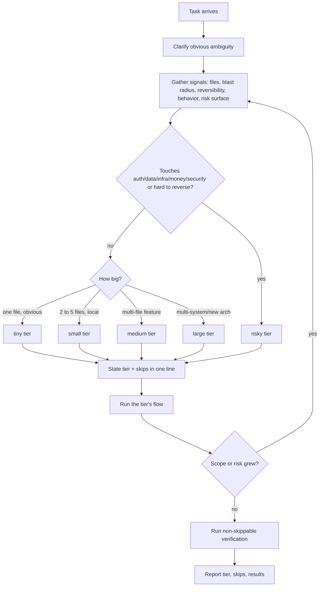

# Adaptive Flow

Adaptive Flow is the Vibe Coding OS rule for spending exactly as much process as a task
deserves. The default lifecycle is `Intent → Spec → Plan → Implement → Test → Review →
Memory → Merge`, but running all eight steps on a typo wastes effort, and running only one on
an auth change is dangerous. Adaptive Flow classifies each task into a tier and runs the
lightest flow that still proves the work and protects the system.

This document explains the model and shows worked examples. The operating procedure lives in
`skills/core/adaptive-flow/SKILL.md`; the command entry point is `commands/vibe-flow.md`.

## The five tiers

| Tier | Typical signal | What you run | What you safely skip |
| --- | --- | --- | --- |
| **tiny** | One file, obvious, reversible, no behavior change | Intent → Implement → quick verify | Spec, plan, tasks, brief, ADR |
| **small** | 2–5 files, local behavior change, easy to test | Intent → one-line spec note → Implement → targeted test → verify | Standalone spec, written plan, tasks, brief |
| **medium** | Multi-file feature, bounded but unclear, user-visible | Spec → Plan → Tasks (status) → Implement → review → memory | ADR, subagents, parallel exploration (brief is recommended, not required) |
| **large** | Multi-system, new architecture, parallelizable | Full lifecycle + ADR + parallel exploration + subagents + brief + review-before-merge | Nothing structural; only redundant ceremony |
| **risky** | Touches auth, data, infra, money, security; hard to reverse — at any size | Large flow + characterization tests + rollback plan + security review + separate reviewer pass | Nothing that protects correctness or reversibility |

Risk is a multiplier, not just a size. A one-line change to a permission check is `risky`,
not `tiny`, even though it touches one file.

## Non-negotiables

Some steps are never skipped, no matter how light the tier:

- **Confirm intent.** Always restate what is being asked before editing.
- **Minimal verification.** Every tier ends with the smallest check that proves the change
  works. "It should work" is not done.
- **Privacy and attribution hygiene.** No secrets in memory or logs; no uncredited upstream
  copying — at every tier.

For `risky` work, three more become non-negotiable: rollback thinking, characterization tests
before changing existing behavior, and a review pass from outside the author's active context.

## Skip lightweight, not silent

When you drop a step, say so in one line ("Treating this as tiny: implementing directly,
skipping spec/plan, will run the unit test to verify"). This gives the user a chance to
object before the work happens. A silent skip looks identical to a forgotten step.

## Flowchart

## Worked examples

**Tiny — fix a typo in a README.** One file, no behavior change, instantly reversible. Flow:
restate intent, make the edit, confirm the file renders. No spec, no plan. One line up front:
"Tiny edit, fixing the typo directly, verifying the doc still builds."

**Small — add a `timeout` param to one function.** Two files (function + its test), local
behavior change. Flow: note the intended behavior in one line, implement, update the test that
exercises the function, run that test. Skip the standalone spec and written plan.

**Medium — add pagination to a list endpoint.** Several files across route, query, and
response shape; user-visible. Flow: write a short spec (`vibe-spec`), a plan
(`vibe-plan`), ordered tasks with status (`vibe-tasks`), implement, review, record memory. An
implementation brief helps but is optional.

**Large — introduce a caching layer across services.** New architecture, many files,
parallelizable. Flow: full lifecycle, an ADR for the caching decision, parallel exploration of
the affected services, subagents for bounded subtasks, an implementation brief, and an
explicit review-before-merge pass.

**Risky — change how auth tokens are validated.** One module, but it gates access. Treat as
`risky` regardless of size. Flow: the large flow plus characterization tests that pin current
auth behavior before touching it, a rollback plan in the implementation plan, a security
review, and a reviewer pass from a separate context. Never skip any of these to save time.

## Standards-flow mapping

Specific `STANDARDS.md` entries impose flow requirements that override the tier rubric.
The table below maps each standard to the flow tier that activates it and the step it adds.

| Standard section | Trigger | Added step | Overrides which skip |
| --- | --- | --- | --- |
| Coding — smallest change | Any coding task | None (always satisified by any tier) | — |
| Documentation — file layout | Creating/renaming a command, skill, or template | Validate file path matches convention | tier that skips validation |
| Testing — `npm run validate` | Structural changes | Run `npm run validate` before marking done | any tier that skips testing |
| Attribution — update index.json | Adapting a tracked idea | Update `references/index.json` + changelogs | tier that skips reference updates |
| Maintenance — revise this file | Convention becomes stable | Propose a STANDARDS.md update in memory notes | any tier that skips memory |

When a standard is active, the flow must cite the standard that forced the extra step in
the one-line tier announcement. For example: "Treating as small (standards mandate:
update index.json + changelogs)."

## Re-classification

Tiers are not locked in. A "tiny" rename that turns out to touch a database migration is no
longer tiny — stop, re-classify upward, and add the steps the higher tier requires before
continuing. The cheap mistake is over-classifying and adding a little ceremony; the expensive
one is under-classifying risky work and skipping the checks that would have caught the
failure.

## Relationship to the rest of the workflow

Adaptive Flow does not replace the lifecycle or the other `vibe-*` commands — it decides how
much of them to run. It composes with the Superpowers-inspired workflow
(`docs/workflows/superpowers-inspired-workflow.md`) and the spec-driven layer: those define the
steps, Adaptive Flow sets their weight.

## Ghi chú tiếng Việt

Adaptive Flow quyết định "tiêu" đúng lượng quy trình cho mỗi task. Vòng đời mặc định là
`Intent → Spec → Plan → Implement → Test → Review → Memory → Merge`, nhưng chạy đủ tám bước
cho một lỗi chính tả là lãng phí, còn chạy một bước cho thay đổi auth là nguy hiểm. Phân loại
task thành năm mức (tiny/small/medium/large/risky); rủi ro là hệ số nhân, không chỉ là kích
thước — sửa một dòng ở kiểm tra quyền vẫn là `risky`. Luôn giữ ba điều không bao giờ bỏ: xác
nhận ý định, verify tối thiểu, và kiểm tra quyền riêng tư/ghi công. Task risky thêm: test đặc
tả hành vi cũ, kế hoạch rollback, review bảo mật và một lượt review từ ngữ cảnh khác. Nói rõ
mức đã chọn và bước đã bỏ, đừng bỏ lặng lẽ; phân loại lại nếu phạm vi/rủi ro tăng. Nội dung
gốc của Vibe Coding OS.
