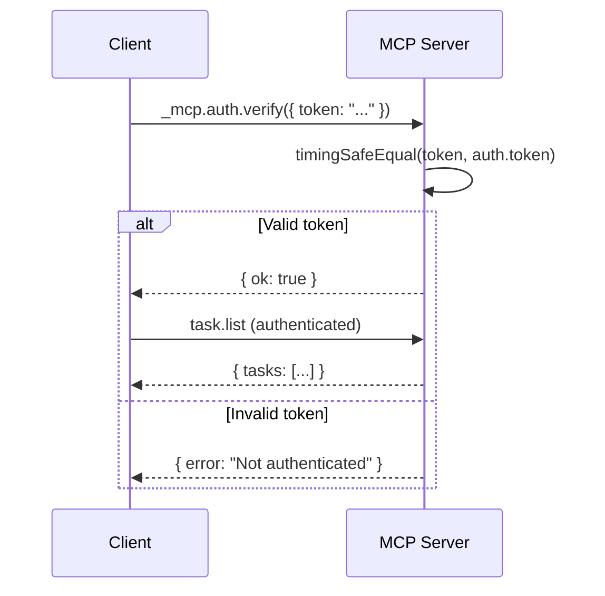

# Runtime MCP Server

An opt-in [Model Context Protocol](https://modelcontextprotocol.io) server that
exposes local runtime operations (tasks, memory, checkpoints) as stdio-based
MCP tools.

## Prerequisites

- Node.js >= 18
- `@modelcontextprotocol/sdk` — install via `npm install` (the maintainer
  must add it to `package.json` first — see [Setup](#setup) below).

## Setup

1. Add the SDK to `package.json` (pinned exact version):

   ```jsonc
   "dependencies": {
     "@modelcontextprotocol/sdk": "<latest-version>"  // pin exact
   }
   ```

2. Optionally add a convenience script:

   ```jsonc
   "scripts": {
     "runtime:mcp": "node scripts/runtime-mcp.mjs"
   }
   ```

3. Install: `npm install`

## Registering in `.mcp.json`

Add an entry to your project's `.mcp.json` (or `~/.claude/.mcp.json` for
global availability):

```json
{
  "mcpServers": {
    "vibe-runtime": {
      "command": "node",
      "args": ["scripts/runtime-mcp.mjs"]
    }
  }
}
```

Once registered, the MCP client (e.g. Claude Desktop, Claude Code) will start
the server alongside your session and the tools become available.

## Provided tools

| Tool | Description |
| ---- | ----------- |
| `_mcp.auth.verify` | Authenticate the session via token handshake. Required before any other tool. |
| `task.list` | List all runtime tasks with status and dependencies. |
| `task.next` | Return the next ready task (pending + deps satisfied), or null. |
| `task.update` | Change a task's status. |
| `memory.search` | Substring-search runtime memory records by content/tags. |
| `memory.ingest` | Write a new memory record (content is privacy-redacted). |
| `checkpoint.create` | Record a checkpoint gate (readiness/done evidence). |
| `vibe.spec` | Run the spec-first workflow on a given spec file. |
| `vibe.plan` | Generate a plan from specification. |
| `vibe.review` | Review implementation against its spec. |
| `vibe.memory` | Query the skills/memory layer for context. |
| `vibe.merge` | Trigger the merge pipeline (post-implementation). |
| `autopilot.start` | Start an autonomous coding loop with the configured policy. |
| `autopilot.status` | Query current autopilot session status. |
| `autopilot.list` | List completed autopilot sessions. |
| `autopilot.stop` | Stop the active autopilot session. |

> **Total: 16 tools** (1 auth, 3 task, 3 memory, 1 checkpoint, 5 vibe, 4 autopilot).

## Authentication

v2.17.6 adds a **token-gated handshake** to the MCP server. Each MCP session must call `_mcp.auth.verify` with a valid token before any other tool works.

### How the token is resolved

The server checks these sources in order (first found wins):

1. **`MCP_AUTH_TOKEN` environment variable** — set this before starting the MCP server
2. **`~/.vibe/mcp-token` file** — managed manually or auto-generated
3. **Auto-generate** — if neither of the above exists, the server writes a random 48-hex-char token to `~/.vibe/mcp-token` with `0o600` permissions

### Quick start (three modes)

**Mode A: Auto-generated token (simplest)**

Start the MCP server with no configuration:

```bash
node scripts/runtime-mcp.mjs
# → [mcp-auth] No MCP_AUTH_TOKEN set — auto-generated token written to ~/.vibe/mcp-token
```

Your MCP client reads `~/.vibe/mcp-token` and includes the token in `_mcp.auth.verify` calls. Works out of the box — no setup needed.

**Mode B: Environment variable**

```bash
export MCP_AUTH_TOKEN="my-secure-token"
node scripts/runtime-mcp.mjs
```

This takes precedence over any file-based token.

**Mode C: Token file**

```bash
echo -n "my-token-from-file" > ~/.vibe/mcp-token
chmod 600 ~/.vibe/mcp-token
node scripts/runtime-mcp.mjs
```

### Workflow



### Security model

- Token comparison uses `crypto.timingSafeEqual()` — no timing side-channel leak
- Auto-generated token = 192 bits (24 random bytes → 48 hex chars)
- File permissions: `0o600` (owner read/write only)
- No token expiry (acceptable for local stdio transport per ADR 0001)
- See [`docs/SECURITY-MODEL.md`](SECURITY-MODEL.md) sections 6-7 for the full threat model

### Troubleshooting

**"Not authenticated" on every call:**
- Check `MCP_AUTH_TOKEN` spelling (it's `MCP_AUTH_TOKEN`, not `MCP_API_TOKEN` or `MCP_TOKEN`)
- Verify `~/.vibe/mcp-token` exists and is readable (`cat ~/.vibe/mcp-token`)
- Call `_mcp.auth.verify({ token: "the-token" })` before any other tool

**"Tool not allowed":**
- The MCP adapter allowlist in `runtime/core/tool-contract.mjs` only permits specific tools
- Auth-required tools must be registered in the allowlist for the `mcp` adapter

## Local testing

```bash
node scripts/runtime-mcp.mjs --help
node scripts/runtime-mcp.mjs --tools
node scripts/runtime-mcp.mjs           # start on stdio (requires SDK)
```

## Design

- Thin wrappers around `runtime/tasks/task-store.mjs`,
  `runtime/memory/memory-store.mjs`, `runtime/memory/retrieval.mjs`, and
  `runtime/checkpoints/checkpoint-engine.mjs`.
- The SDK is loaded via dynamic `import()` so that `--help` and `--tools`
  work even when the package is not installed.
- Tool schemas are plain JSON Schema — no Zod or code generation.
- All state mutations go through the existing atomic-JSON-store layer
  (locks, atomic writes).
