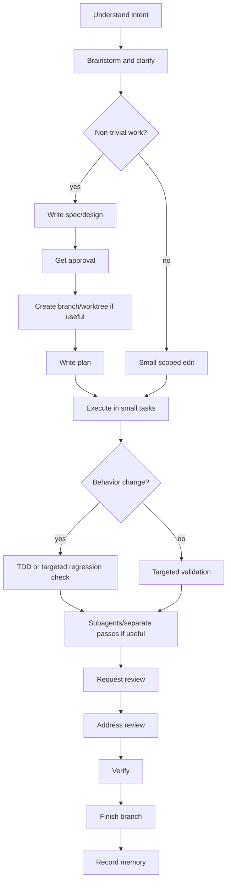

# Superpowers-Inspired Vibe Coding OS Workflow

Vibe Coding OS adapts the useful discipline patterns from `obra/superpowers` into local skills, commands, registries, and reference documents. The goal is not to copy the upstream framework; it is to make the same class of agent behavior explicit in this repository: clarify before coding, plan before broad edits, test behavior changes, review before merge, and verify before claiming completion.

## Workflow phases

1. **Understand intent** — Read the user request, repository instructions, current branch state, relevant registries, and existing artifacts.
2. **Brainstorm and clarify** — Use `skills/core/brainstorming/SKILL.md` or `commands/vibe-brainstorm.md` to expose assumptions, options, risks, and questions.
3. **Write design/spec** — For non-trivial work, create or update a compact spec using `commands/vibe-spec.md` and `templates/spec-template.md`.
4. **Get user approval for non-trivial work** — Do not treat an exploratory design as permission to implement if the user asked for approval first or if major decisions remain unresolved.
5. **Create isolated branch or worktree** — Use `skills/core/using-git-worktrees/SKILL.md` or `commands/vibe-worktree.md` when isolation protects user changes or enables parallel work.
6. **Write implementation plan** — Use `skills/core/writing-plans/SKILL.md` or `commands/vibe-write-plan.md` to name steps, files, risks, rollback points, and checks.
7. **Execute plan in small tasks** — Use `skills/core/executing-plans/SKILL.md` or `commands/vibe-execute-plan.md` and keep edits scoped.
8. **Use TDD when behavior changes** — Use `skills/core/test-driven-development/SKILL.md`; prefer red/green/refactor when a meaningful test seam exists.
9. **Use subagents or separate passes when helpful** — Use `skills/core/subagent-driven-development/SKILL.md` for bounded independent subtasks, tester passes, reviewer passes, or parallel exploration.
10. **Request review** — Use `skills/core/requesting-code-review/SKILL.md` to package scope, diff, checks, risks, and questions.
11. **Address review** — Use `skills/core/receiving-code-review/SKILL.md` to triage comments, fix blockers, rerun checks, and document deferrals.
12. **Verify** — Use `skills/core/verification-before-completion/SKILL.md` or `commands/vibe-verify.md` before claiming completion.
13. **Finish branch** — Use `skills/core/finishing-a-development-branch/SKILL.md` or `commands/vibe-finish-branch.md` to prepare PR/handoff, final checks, attribution, and cleanup.
14. **Record memory** — Use `commands/vibe-memory.md` and memory skills to preserve durable decisions without secrets.

## Flowchart

## Local adaptation rules

- Keep upstream ideas in the Reference Intelligence Layer; keep local procedures original.
- Use aliases carefully: `clarify-before-code` aligns with brainstorming, `plan-driven-execution` aligns with writing/executing plans, `review-before-merge` aligns with requesting/receiving review, and `verification-before-done` aligns with verification before completion.
- Prefer the lightest workflow that protects the task. Tiny edits do not need every ritual; risky work does.
- Multi-harness support means procedures should work for Claude Code, Codex, Cursor, Gemini CLI, OpenCode, and similar assistants without relying on one brand-specific feature.
